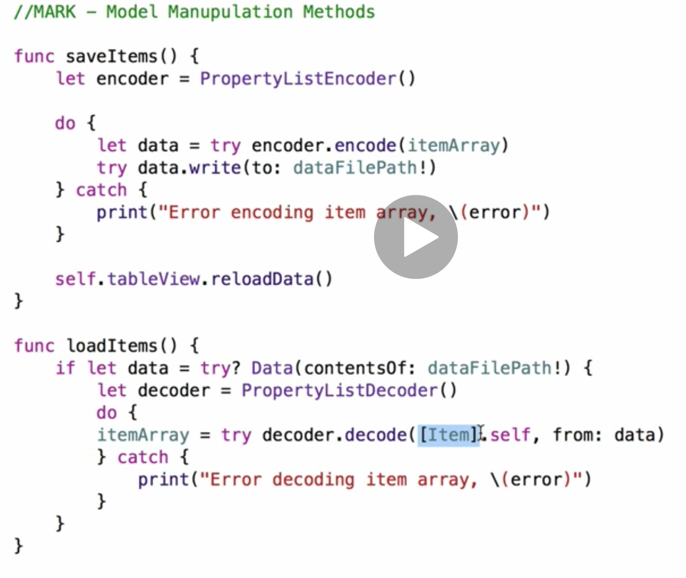

# Todoey
A simple ToDo list app to demonstrate the various on-device data storage solutions

- [User Defaults](https://developer.apple.com/documentation/foundation/userdefaults): Store basic data types (configs, user settings), everything is stored in a property file, this makes it inefficient for larger data sets
- [NSCoder](https://developer.apple.com/documentation/foundation/nscoder): Abuse the Plist by storing complex data types by storing complex objects that conform to the Codable protocol

- Core Data: this is the real deal
